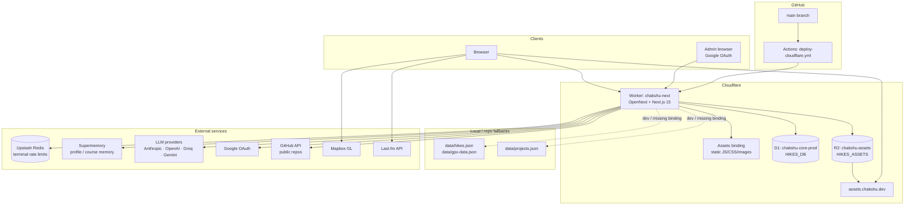
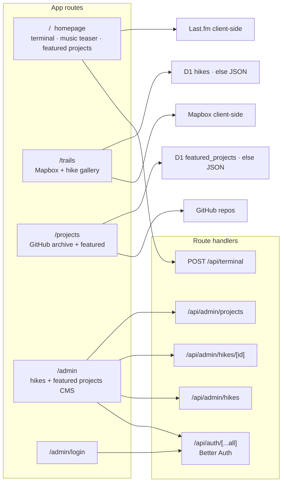
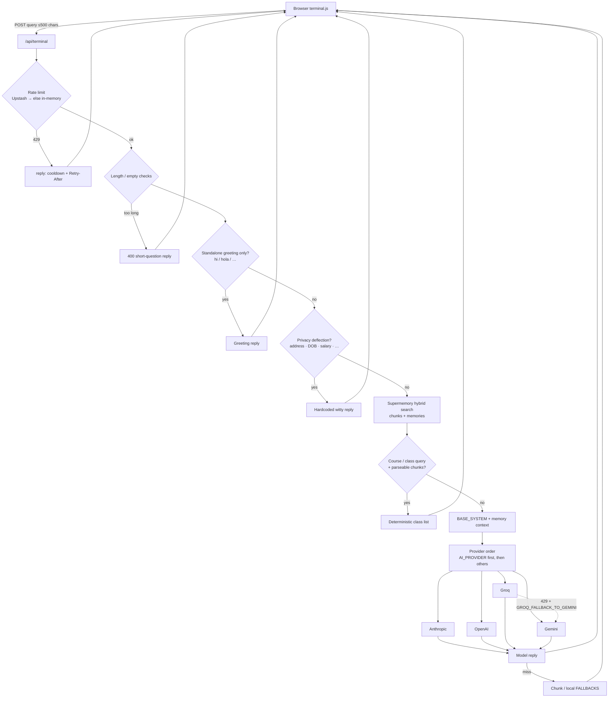
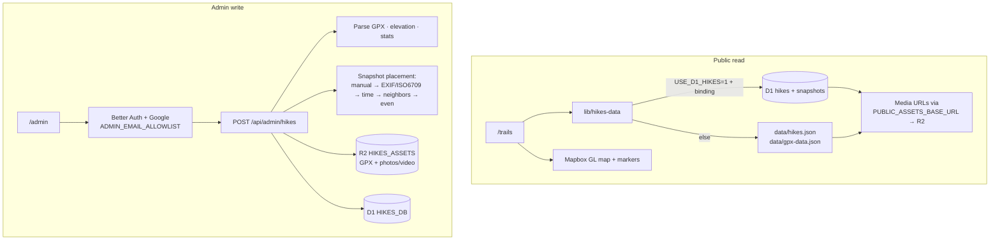
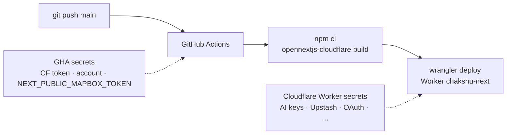

# chakshu.dev
My personal portfolio. Live at https://chakshu.dev

Stack: **Next.js 15** (App Router) → **OpenNext** → **Cloudflare Workers**, with D1, R2, Upstash Redis, and Better Auth.

### Run locally

```bash
npm install
npm run dev
```

Open `http://localhost:3000`.

---

## Architecture

High-level map of how the site is built, deployed, and how each major feature talks to storage and external APIs.

### System overview



### Public surfaces → APIs



### Terminal pipeline

`public/terminal.js` posts to `POST /api/terminal`. Server path is rate-limit → privacy gates → memory → model waterfall → fallbacks.



**Guarantees worth knowing:**
- Queries capped at 500 chars; provider / Supermemory / Upstash fetches time out at ~10s.
- Rate limits: default **8 req / 60s / IP**, then **5 min** block (`RATE_LIMIT_*`). Shared via Upstash when configured.
- Privacy deflections never reach an LLM.
- Client keeps a synced offline fallback copy if the API is down.

### Trails + admin data path



### Deploy pipeline



Runtime secrets (LLM keys, Upstash, Google OAuth, etc.) live on the **Worker**, not in GitHub Actions — except `NEXT_PUBLIC_MAPBOX_TOKEN`, which is baked in at build time.

---

## Terminal API Setup

The portfolio terminal calls `POST /api/terminal` (`src/app/api/terminal/route.ts`).

### 1. Configure environment variables

Local: `.env.local`. Production: Cloudflare Worker secrets / vars.

- `AI_PROVIDER=anthropic`, `openai`, `groq`, or `gemini`
- If using Anthropic:
	- `ANTHROPIC_API_KEY`
	- Optional: `ANTHROPIC_MODEL` (default: `claude-sonnet-4-20250514`)
- If using OpenAI:
	- `OPENAI_API_KEY`
	- Optional: `OPENAI_MODEL` (default: `gpt-4o-mini`)
- If using Groq:
	- `GROQ_API_KEY`
	- Optional: `GROQ_MODEL` (default: `llama-3.1-8b-instant`)
	- Optional: `GROQ_FALLBACK_TO_GEMINI=true`
- If using Gemini:
	- `GEMINI_API_KEY`
	- Optional: `GEMINI_MODEL` (default: `gemini-1.5-flash`)
- Optional: `SUPERMEMORY_API_KEY` for grounded answers (classes, profile facts)

Groq fallback behavior:

- When `AI_PROVIDER=groq`, the API tries Groq first.
- If Groq responds with HTTP 429 and `GROQ_FALLBACK_TO_GEMINI=true`, it automatically retries with Gemini.
- On the next request, it tries Groq first again.

### Rate limiting

The endpoint enforces IP-based limits before calling the model provider.

- `RATE_LIMIT_WINDOW_MS` (default: `60000`)
- `RATE_LIMIT_MAX_REQUESTS` (default: `8`)
- `RATE_LIMIT_BLOCK_MS` (default: `300000`)
- `RATE_LIMIT_KEY_PREFIX` (default: `terminal_rl`)

If a client exceeds the limit, the API returns `429 rate_limited` with a `Retry-After` header.

### Shared global limits (recommended)

To enforce limits across all Worker isolates, connect Upstash Redis:

- `UPSTASH_REDIS_REST_URL` — HTTPS REST URL (not the redis-cli string)
- `UPSTASH_REDIS_REST_TOKEN`

Behavior:

- If Upstash vars are set, the API uses Redis-backed shared rate limiting.
- If Upstash is unavailable at runtime, the API falls back to in-memory limiting so protection still remains.

### 2. Run locally

```bash
npm run dev
```

### 3. Deploy

Deploy via GitHub Actions on `main`, or locally:

```bash
npm run deploy
```

Set the same runtime secrets on the Cloudflare Worker (`npx wrangler secret put …`). The terminal UI calls `/api/terminal` on the deployed Worker automatically.

## Featured Projects + `/projects`

Homepage featured cards are curated in D1 (`featured_projects`) via `/admin` → **projects**.

- Public archive: `/projects` (all public GitHub repos for `FornaxChemica`, searchable/filterable)
- Featured source: D1 when `USE_D1_HIKES=1` + binding available, else `data/projects.json`
- Admin API: `GET`/`PUT` `/api/admin/projects`

### 1. Migrate + seed D1

```bash
npx wrangler d1 execute chakshu-core-prod --remote --file=db/migrations/0002_create_featured_projects.sql
npx wrangler d1 execute chakshu-core-prod --remote --file=db/seed-featured-projects.sql
```

Use the same files with `--local` if you develop against local D1.

### 2. Optional GitHub token

Unauthenticated GitHub API works, but rate limits are low. For production:

```bash
npx wrangler secret put GITHUB_TOKEN
```

Also set `GITHUB_TOKEN` in `.env.local` for local `/projects` fetches.

Match `repo_name` in admin/D1 to the exact GitHub repository name so featured badges join correctly.

Optional `logo_url` overrides the card mark. Otherwise live `homepage`/`homepage_url` uses the site favicon; GitHub-only repos use the GitHub logo.

If `0002` already ran without `logo_url`:

```bash
npx wrangler d1 execute chakshu-core-prod --remote --file=db/migrations/0003_add_featured_project_logo_url.sql
```

## D1 + R2 Trails Data (Cloudflare)

The app supports a dual-source trails loader:

- Primary: Cloudflare D1 table data (`HIKES_DB` binding)
- Fallback: local `data/hikes.json` + `data/gpx-data.json`

So local/dev still works even before D1 is fully configured.

### 1. Create D1 database

```bash
npx wrangler d1 create chakshu-hikes
```

Copy the returned `database_id`, then uncomment/update `d1_databases` in `wrangler.jsonc` with:

- `binding`: `HIKES_DB`
- `database_name`: `chakshu-hikes`
- `database_id`: your real ID

### 2. Apply schema

```bash
npx wrangler d1 execute chakshu-hikes --file=db/migrations/0001_create_hikes_tables.sql
```

### 3. Generate seed SQL from current JSON

```bash
npm run d1:seed:generate
```

This writes `db/seed.sql`.

### 4. Seed D1

```bash
npx wrangler d1 execute chakshu-hikes --file=db/seed.sql
```

### 5. R2 asset base URL (optional but recommended)

When your R2 custom domain is ready (for example `https://assets.chakshu.dev`), set:

- `PUBLIC_ASSETS_BASE_URL` in `wrangler.jsonc` (non-secret)

or set env-specific vars in Cloudflare dashboard.

This lets D1 store relative object paths while the app serves full asset URLs.

### 6. Enable D1 reads in app runtime

Set:

- `USE_D1_HIKES=1`

Keep it `0` until D1 binding + seed are complete.

## Admin Upload Flow (`/admin`)

The repo includes a private admin uploader that lets you publish hikes without editing JSON files in git:

- Route: `/admin`
- API: `POST /api/admin/hikes`
- Uploads GPX + photos to R2
- Writes hike + snapshot records to D1
- Computes GPX geometry/elevation/profile and trail stats
- Placement priority:
  1. manual `at`
  2. manual `lat/lon`
  3. embedded GPS metadata (JPEG EXIF + QuickTime ISO6709 videos)
  4. timestamp interpolation
  5. neighbor interpolation
  6. even distribution fallback
- Spreads media with identical placement so stacked files at one spot remain clickable

### Required Cloudflare bindings

In `wrangler.jsonc`, set:

- D1 binding: `HIKES_DB` -> `chakshu-core-prod`
- R2 binding: `HIKES_ASSETS` -> `chakshu-assets`
- Optional var: `PUBLIC_ASSETS_BASE_URL=https://assets.chakshu.dev`

### Admin auth (BetterAuth + Google OAuth)

Admin now uses BetterAuth Google sign-in:

- Login page: `/admin/login`
- BetterAuth handler: `/api/auth/[...all]`
- Protected pages/API: `/admin`, `/api/admin/*`

Required env vars:

- `BETTER_AUTH_URL=https://chakshu.dev`
- `BETTER_AUTH_SECRET=<long-random-secret>`
- `GOOGLE_CLIENT_ID=<google-oauth-client-id>`
- `GOOGLE_CLIENT_SECRET=<google-oauth-client-secret>`
- `ADMIN_EMAIL_ALLOWLIST=chakshuvinayjain@gmail.com`

Google OAuth redirect URIs:

- `https://chakshu.dev/api/auth/callback/google`
- `https://www.chakshu.dev/api/auth/callback/google`
- `http://localhost:3000/api/auth/callback/google`
